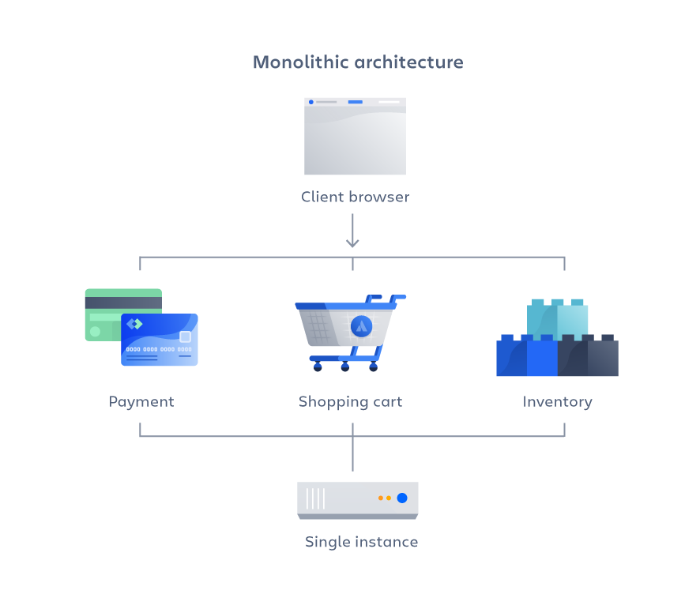

A monolithic architecture is a traditional software design approach where an entire application is built as a single, tightly integrated unit.
In a monolithic architecture, all components and modules of the application are combined into a single codebase, and they share the same runtime environment and database.

## Benefits

- **Simplicity:** Monolithic architectures are often simpler to develop and deploy, making them suitable for small to moderately complex applications.
- **Ease of Testing:** Testing is simpler because all components are closely integrated.
- **Development Velocity:** Developers can make changes across the application quickly since they are working within a single codebase.
- **Lower Latency:** Intra-application communication within the same runtime environment is often faster compared to inter-service communication in a microservices architecture.

## How to Adopt

### Project Setup and Design:

- **Define the Scope:** Clearly define the scope of your application.
- **Architecture and Design:** Plan the architecture of your application.
- **Select Technology Stack:** Choose the programming languages, frameworks, and tools that are most suitable for your application's requirements.

### Development and Implementation:

- **Modular Design:** Break down the application into logical modules or components.
- **Coding Standards:** Establish coding standards and guidelines to ensure consistency and maintainability across the codebase.
- **Database Design:** Design the database schema for your application.

### Testing and Deployment:

- **Unit Testing:** Write unit tests for each module or component to ensure that they function as expected.
- **Integration Testing:** Conduct integration testing to verify that different modules of the application work together seamlessly.
